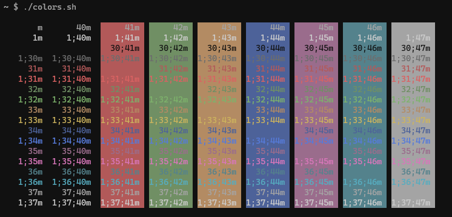
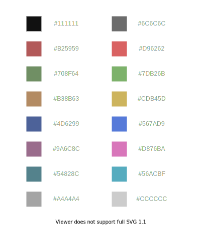

# Hikage terminal colorscheme

Hikage (ひかげ、日陰; "shade" in Japanese) is a dark, less saturated 16 colors terminal color scheme.

## Color palette

## Terminal configurations

 * [Xresources](Xresources)
 * [Windows Terminal](WindowsTerminal.json)
